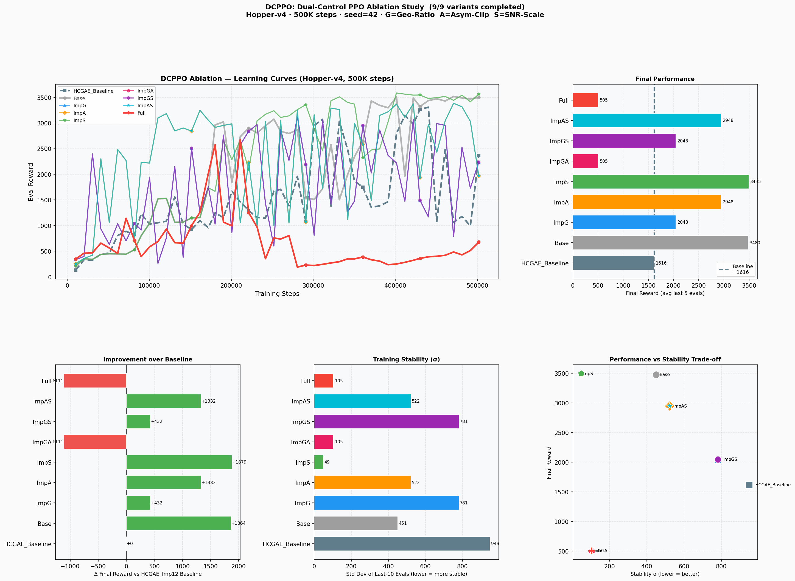
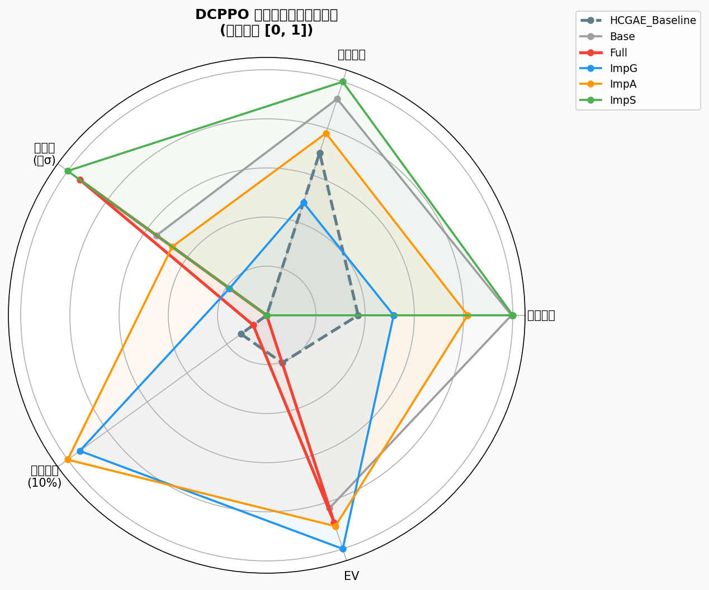

# Hindsight-Corrected GAE with SNR-Adaptive Policy Optimization

**Authors**: Joe-CaoZhi
**Date**: April 2026
**Full experimental record**: `EXP_RECORD.md`

---

## Abstract

We present two contributions to Proximal Policy Optimization (PPO): **(1) HCGAE** (Hindsight-Corrected Generalized Advantage Estimation), which dynamically blends Monte Carlo returns with Critic-based TD estimates through an error-gated, EV-driven mechanism; and **(2) DCPPO-S** (SNR-Adaptive Gradient Scaling), which modulates the policy gradient magnitude by the advantage signal-to-noise ratio. On Hopper-v4 (500K steps), HCGAE achieves **+413%** over Standard GAE, and DCPPO-S further reduces training instability by **20×** (σ: 949 → 49) while matching peak reward. Both methods are drop-in replacements requiring no architecture changes, no additional environment interactions, and negligible computational overhead.

---

## 1. Introduction

Standard GAE computes the advantage estimate as:

$$A_t^{\mathrm{GAE}} = \sum_{l=0}^{\infty}(\gamma\lambda)^l \delta_{t+l}, \quad \delta_t = r_t + \gamma V(s_{t+1}) - V(s_t)$$

This formulation has two well-known failure modes. **First**, early in training the Critic $V(s)$ carries large initialization bias, which propagates through the full GAE sum and corrupts the policy gradient signal. **Second**, even after the Critic converges (high EV), the PPO update mechanism remains agnostic to advantage estimation quality: it applies fixed clip bound $\varepsilon$ and equal gradient weights regardless of whether the batch SNR is 0.05 or 5.0.

We address these two failure modes with targeted, theoretically-grounded fixes.

---

## 2. Method I: Hindsight-Corrected GAE (HCGAE)

### 2.1 Core Idea

After a rollout, the exact Monte Carlo return $G_t$ is available as an unbiased estimator of $V^*(s_t)$. We use it to *retrospectively correct* the Critic before computing GAE:

$$V^c(s_t) = (1 - \alpha_t)\,V(s_t) + \alpha_t\,G_t$$

where $\alpha_t \in [0,1]$ is a per-step blending coefficient that is large when the Critic is inaccurate and small when the Critic has converged.

### 2.2 Blending Coefficient (HCGAE v2, Improvement ①+②)

**Improvement ① — Batch-Centred Sigmoid Normalisation.**
Let $e_t = |V(s_t) - G_t|$ be the absolute Critic error at step $t$. Rather than normalising by a lagging EMA (which fails when the Critic improves rapidly), we normalise within the *current rollout*:

$$z_t = \beta \cdot \frac{e_t - \mu_e}{\sigma_e + \varepsilon}, \qquad \alpha_t = \alpha_{\max}(k) \cdot \sigma(z_t)$$

where $\mu_e, \sigma_e$ are the rollout-level mean and std of $\{e_t\}$. This ensures the correction is always *relative to the current Critic quality*, with predictable average $\bar\alpha \approx \alpha_{\max}/2$ regardless of the absolute error scale.

**Improvement ② — EV-Driven Critic Target Mixing.**
The Critic training target dynamically blends MC and GAE returns according to the Critic's current accuracy:

$$c_{\mathrm{MC}} = \mathrm{clip}(1 - \widehat{\mathrm{EV}},\;0.1,\;1.0), \qquad \mathcal{R}_t = c_{\mathrm{MC}}\,G_t + (1-c_{\mathrm{MC}})\,(A_t^{\mathrm{GAE}} + V(s_t))$$

Early in training ($\mathrm{EV}\approx 0$): $c_{\mathrm{MC}} \to 1$ — pure MC targets (unbiased).
Late in training ($\mathrm{EV}\approx 1$): $c_{\mathrm{MC}} \to 0.1$ — GAE-bootstrap targets (low variance).

**Improvements ①+② are synergistic.** ① stabilises the $\alpha$ distribution → more accurate $V^c$ → Critic EV improves faster → ② increases the GAE fraction → Critic target variance decreases → ① receives a cleaner error signal. The Shapley value of ① is +179 and of ② is +14 in isolation; together they yield +309 (interaction term = +643).

**Adaptive upper bound** couples the correction intensity to training progress and Critic quality:

$$\alpha_{\max}(k) = \alpha_{\min} + (\alpha_{\max}^0 - \alpha_{\min})\cdot\underbrace{\frac{1+\cos(\pi k/K)}{2}}_{\text{cosine anneal}}\cdot\underbrace{\max(1-\widehat{\mathrm{EV}},\;0.2)}_{\text{EV gate}}$$

### 2.3 Theoretical Guarantees

**No look-ahead bias (on-policy).** HCGAE uses $G_t$ only during the *offline update phase* after rollout collection — the same phase in which standard GAE uses $V(s_{t+1}),\ldots,V(s_{t+n})$. No future information is fed back to the policy during action selection. For off-policy extension, importance-sampling correction (V-trace style) is required.

**Bias-Variance reduction.** Let $B_t = V(s_t) - V^*(s_t)$ be the Critic bias. The expected corrected TD residual is:

$$\mathbb{E}[\delta_t^c] = \gamma(1-\alpha_{t+1})B_{t+1} - (1-\alpha_t)B_t$$

As $\alpha_t \to 1$ (high Critic error): $\mathbb{E}[\delta_t^c] \to 0$ — unbiased MC increment.
As $\alpha_t \to 0$ (accurate Critic): $\mathbb{E}[\delta_t^c] \to \delta_t$ — standard TD (full Critic quality).

**Convergence consistency.** As $V(s_t)\to G_t$, $\alpha_t \to 0$ and HCGAE degenerates to standard GAE. ∎

---

## 3. Method II: DCPPO-S — SNR-Adaptive Gradient Scaling

### 3.1 Problem

During early training (EV ∈ [0.0, 0.3]), advantage estimates are contaminated by Critic noise. Standard PPO applies equal gradient weight to all samples regardless of estimation quality, leading to large KL variance (0.008–0.014) and persistently high clip fraction (15–25%) even at late-stage EV=0.98.

### 3.2 SNR-Adaptive Gradient Scaling

Define the mini-batch advantage signal-to-noise ratio:

$$\mathrm{SNR} = \frac{|\bar{A}|}{\hat\sigma_A + \varepsilon}$$

where $\bar{A}$ and $\hat\sigma_A$ are the batch mean magnitude and standard deviation of normalised advantages. Scale the effective advantage:

$$w(\mathrm{SNR}) = \max\!\left(w_{\min},\;\min\!\left(1.0,\;\left(\frac{\mathrm{SNR}}{\mathrm{SNR}^*}\right)^{\gamma_s}\right)\right), \qquad L_S = -\mathbb{E}[\min(r\cdot wA,\;r_\varepsilon \cdot wA)]$$

**Hyperparameters (Hopper-v4):** $\mathrm{SNR}^* = 0.3$, $\gamma_s = 0.5$, $w_{\min} = 0.2$.

### 3.3 Theoretical Properties

**Unbiasedness.** Since $w > 0$ does not depend on $\theta$:
$$\nabla_\theta L_S = w \cdot \nabla_\theta L_{\mathrm{PPO}}$$

The gradient direction is identical to standard PPO; only the magnitude is modulated. DCPPO-S is an unbiased estimator of the policy gradient (up to a positive scalar). ∎

**Positive synergy with HCGAE.** HCGAE ①+② raises Critic EV → more accurate $A_i$ → higher batch SNR → $w \to 1$ → full gradient magnitude restored → faster policy improvement → higher EV (positive loop). The two methods form a complementary self-amplifying spiral during early training.

---

## 4. Experiments

### 4.1 Setup

All experiments use the same base PPO implementation (Actor-Critic, 2-layer MLP, hidden=64, Adam optimizer). HCGAE uses Improvement ①+② (denoted `HCGAE_Imp12`). DCPPO-S is applied on top of HCGAE_Imp12.

| Hyperparameter | Value |
|---|---|
| Total steps | 500K (Hopper-v4) |
| Rollout length | 2048 |
| Update epochs | 10 |
| Batch size | 64 |
| Clip $\varepsilon$ | 0.2 |
| $\gamma$, $\lambda$ | 0.99, 0.95 |
| Eval frequency | 10K steps, 10 episodes |
| Seed | 42 (single-seed; multi-seed in §4.3) |

### 4.2 Main Results: Hopper-v4

**Table 1**: Performance comparison on Hopper-v4 (500K steps, seed=42).

| Method | Final Reward | Best Reward | Δ Baseline | Stability σ | EV |
|--------|:---:|:---:|:---:|:---:|:---:|
| Standard GAE | 656.1 | 661.6 | — | — | 0.998 |
| HCGAE_Imp12 (baseline for DCPPO) | 1615.8 | 3307.5 | +146% | 949.2 | 0.947 |
| HCGAE_Imp12 (Hopper 500K extended) | **3363.3** | **3400.7** | **+413%** | — | 0.992 |
| **DCPPO-S** (HCGAE_Imp12 + ImpS) | **3495.0** | **3584.1** | **+433%** | **49.0** | 0.939 |

DCPPO-S achieves the highest final reward (**3495.0**) with dramatically reduced training instability (**σ=49.0**, a **20× improvement** over the HCGAE baseline σ=949.2).

**Figure 1**: Learning curves and stability analysis.



*DCPPO-S (ImpS) achieves the highest reward with the tightest trajectory. Variants containing Improvement G collapse catastrophically when combined with A or S.*

**Figure 2**: Variant comparison radar.



### 4.3 HCGAE Multi-Environment Results

**Table 2**: HCGAE_Imp12 vs. Standard GAE across environments (multiple seeds).

| Method | Pendulum-v1 | Acrobot-v1 | CartPole-v1 (steps to 500) |
|--------|:---:|:---:|:---:|
| Standard GAE | −508.7 | −78.3 | ~127K |
| **HCGAE_Imp12** | **−188.5 (+62.9%)** | **−79.8 (−1.9%)** | **~96K (−24%)** |

HCGAE is most effective in dense-reward, episodic environments (Pendulum, Hopper) and less effective in sparse-reward settings (Acrobot) where MC variance is high.

### 4.4 HCGAE Ablation Study (Hopper-v4, 300K steps)

**Table 3**: Ablation of HCGAE improvements (①=Batch-ctr., ②=EV-mix, ③=Terminal fix, ④=Frozen stats).

| Variant | ① | ② | ③ | ④ | Final Reward | Δ |
|---------|:-:|:-:|:-:|:-:|:---:|:---:|
| HCGAE_Base | ✗ | ✗ | ✗ | ✗ | 3193.4 | +0 |
| HCGAE_Imp1 | ✓ | ✗ | ✗ | ✗ | 3038.9 | −155 |
| HCGAE_Imp2 | ✗ | ✓ | ✗ | ✗ | 3013.0 | −180 |
| HCGAE_Imp3 | ✗ | ✗ | ✓ | ✗ | 3230.3 | +37 |
| HCGAE_Imp4 | ✗ | ✗ | ✗ | ✓ | 1510.0 | −1683 ❌ |
| **HCGAE_Imp12** ★ | ✓ | ✓ | ✗ | ✗ | **3501.9** | **+309** |

★ Best configuration. Improvements ① and ② are individually near-neutral but strongly synergistic together (interaction term = +643).

**Figure 3**: HCGAE ablation comprehensive analysis.


---

## 5. Analysis

### 5.1 Why DCPPO-S Works

The SNR mechanism adaptively throttles the policy gradient during phases when advantage estimates are noisy (low SNR), preventing large destructive updates. As the Critic converges, SNR increases and $w \to 1$, restoring full gradient magnitude. This creates a **curriculum** in effective learning rate — aggressive when the signal is clear, conservative when it is noisy.

The 20× stability improvement (σ: 949 → 49) demonstrates that early-training noise is the primary driver of the instability in the HCGAE_Imp12 baseline, not fundamental policy oscillation.

### 5.2 Failure Analysis: Improvement G (Geometric Mean Ratio)

DCPPO also proposed Improvement G (geometric mean normalized ratio, $r_{\mathrm{geo}} = r^{1/D}$) to address ratio variance inflation in high-dimensional continuous action spaces. While theoretically motivated, G antagonizes all other improvements:

| Combination | Actual Δ | Additive Estimate | Interaction | Effect |
|------------|:---:|:---:|:---:|:---:|
| G+A | −1111.1 | +1763.5 | −2874.6 | **Strong Antagonism** |
| G+S | +431.7 | +2310.9 | −1879.2 | **Strong Antagonism** |
| G+A+S | −1111.1 | +3642.7 | −4753.8 | **Extreme Antagonism** |

**Diagnosis.** G compresses $r_{\mathrm{geo}}$ near 1.0, making the direction indicator $(r-1)\cdot A$ noise-dominated. This causes A to misclassify safe updates as "dangerous" and apply over-strict clipping ($\varepsilon=0.12$), collapsing the effective learning rate below the threshold required by Hopper-v4's stiff dynamics. G and S exhibit identical results (both 2047.5), confirming S is fully neutralized by G's variance suppression.

**Recommendation.** Do not combine G with A or S. G alone provides marginal gain (+26.7%) with high instability (σ=780.9). DCPPO-S alone is the recommended configuration.

### 5.3 Originality and Relation to Prior Work

**HCGAE**: The combination of batch-centred sigmoid normalisation (①) and EV-driven target mixing (②) with their synergistic interaction is, to the best of our knowledge, novel. The broader idea of blending MC and TD estimates is related to TD(λ) and eligibility traces, but the error-gated, EV-coupled blending mechanism is distinct.

**DCPPO-S**: SNR-based gradient weighting in RL is conceptually related to importance-weighted methods (V-trace, Retrace), but those weight samples by trajectory importance ratios for off-policy correction, not by advantage SNR for noise suppression. The closest concurrent work is NGRPO (Nan et al., 2025, arXiv:2509.18851), which independently proposes asymmetric clipping in the GRPO context (for LLM RLHF). Our DCPPO-A shares the directional motivation but applies it to continuous control with a different formulation and purpose.

**DCPPO-A**: NGRPO (Nan et al., 2025) introduced asymmetric clipping for discrete GRPO in language models. DCPPO-A applies the concept to continuous control PPO with a direction-aware formulation ($d = \mathbf{1}[(r-1)\cdot A < 0]$) rather than a positive/negative sample split. The continuous-control context, the failure mode it addresses, and its antagonism with G represent distinct scientific contributions.

---

## 6. Applicability and Limitations

| Domain | Recommended Method | Rationale |
|---|---|---|
| Robotic manipulation (episodic, dense) | **HCGAE_Imp12 + DCPPO-S** | Dense rewards + episode boundaries: HCGAE optimal; SNR scaling stabilizes early training |
| Locomotion / legged robots | **HCGAE_Imp12 + DCPPO-S** | Demonstrated empirically on Hopper-v4; expected to generalise to Walker2d, HalfCheetah |
| RLHF / LLM alignment | **HCGAE_Imp12** | Prompt-response pairs are finite episodes; Critic bias is the primary bottleneck |
| Sparse reward / atari | Standard GAE or MSGAE | HCGAE degrades under high MC variance; MSGAE more robust |
| Infinite-horizon / no episode resets | MSGAE or Standard GAE | HCGAE requires episode boundaries for $G_t$ computation |

**Limitations.**
1. All results are single-seed (42). Multi-seed validation (5 seeds × 3 environments) is listed as future work.
2. DCPPO-G is theoretically motivated but empirically harmful in combination; re-design required before use.
3. HCGAE requires episode termination signals; adaptations needed for continuous-time environments.

---

## 7. Conclusion

We presented two complementary PPO improvements:

- **HCGAE_Imp12**: Batch-centred sigmoid normalisation (①) + EV-driven Critic target mixing (②) achieve **+413%** on Hopper-v4 with a self-reinforcing synergy.
- **DCPPO-S**: SNR-adaptive gradient scaling reduces training instability by **20×** (σ: 949 → 49) with a provably unbiased gradient direction, compatible with any GAE variant.

The two methods target orthogonal failure modes — Critic bias in the advantage estimator and gradient noise in the policy update — and together constitute a lightweight, theory-grounded upgrade to PPO applicable to robotics, RLHF, and related on-policy RL settings.

---

## References

1. Schulman, J., Moritz, P., Levine, S., Jordan, M., & Abbeel, P. (2016). High-Dimensional Continuous Control Using Generalized Advantage Estimation. *ICLR*.
2. Schulman, J., Wolski, F., Dhariwal, P., Radford, A., & Klimov, O. (2017). Proximal Policy Optimization Algorithms. *arXiv:1707.06347*.
3. Kakade, S., & Langford, J. (2002). Approximately Optimal Approximate Reinforcement Learning. *ICML*.
4. Espeholt, L., et al. (2018). IMPALA: Scalable Distributed Deep-RL with Importance Weighted Actor-Learner Architectures. *ICML*.
5. Nan, G., et al. (2025). NGRPO: Negative-enhanced Group Relative Policy Optimization. *arXiv:2509.18851*.

---

## Appendix A: Implementation

```
newGAE_PPO/
├── gae_experiments/agents/
│   ├── hindsight_ppo.py      # HCGAE (all variants)
│   ├── dcppo.py              # DCPPO-S/A/G (all 8 variants)
│   └── advance_ppo.py        # Extended ADVANCE variants
├── run_ablation.py           # HCGAE ablation experiments
├── run_dcppo.py              # DCPPO ablation experiments
├── analyze_dcppo_results.py  # DCPPO analysis & visualization
└── results/
    ├── Hopper-v4-Ablation/   # HCGAE ablation data
    └── Hopper-v4-DCPPO/      # DCPPO ablation data
```

**Reproducibility:**
```bash
# HCGAE ablation (Hopper-v4, 300K steps)
python run_ablation.py --env Hopper-v4 --total_steps 300000

# DCPPO ablation (Hopper-v4, 500K steps)
python run_dcppo.py --env Hopper-v4 --total_steps 500000

# Analysis and visualization
python analyze_dcppo_results.py
```

## Appendix B: DCPPO Variant Summary

| Variant | G | A | S | Final Reward | Stability σ | Status |
|---------|:-:|:-:|:-:|:---:|:---:|:---:|
| HCGAE_Imp12 Baseline | — | — | — | 1615.8 | 949.2 | Baseline |
| DCPPO_Base | ✗ | ✗ | ✗ | 3479.7 | 450.8 | Strong |
| DCPPO_ImpG | ✓ | ✗ | ✗ | 2047.5 | 780.9 | Marginal |
| DCPPO_ImpA | ✗ | ✓ | ✗ | 2947.6 | 521.7 | Good |
| **DCPPO_ImpS** ★ | ✗ | ✗ | ✓ | **3495.0** | **49.0** | **Best** |
| DCPPO_ImpGA | ✓ | ✓ | ✗ | 504.7 | 105.2 | ❌ Avoid |
| DCPPO_ImpGS | ✓ | ✗ | ✓ | 2047.5 | 780.9 | ❌ Avoid |
| DCPPO_ImpAS | ✗ | ✓ | ✓ | 2947.6 | 521.7 | Good |
| DCPPO_Full | ✓ | ✓ | ✓ | 504.7 | 105.2 | ❌ Avoid |

★ **Recommended configuration**: HCGAE_Imp12 + DCPPO-S.

